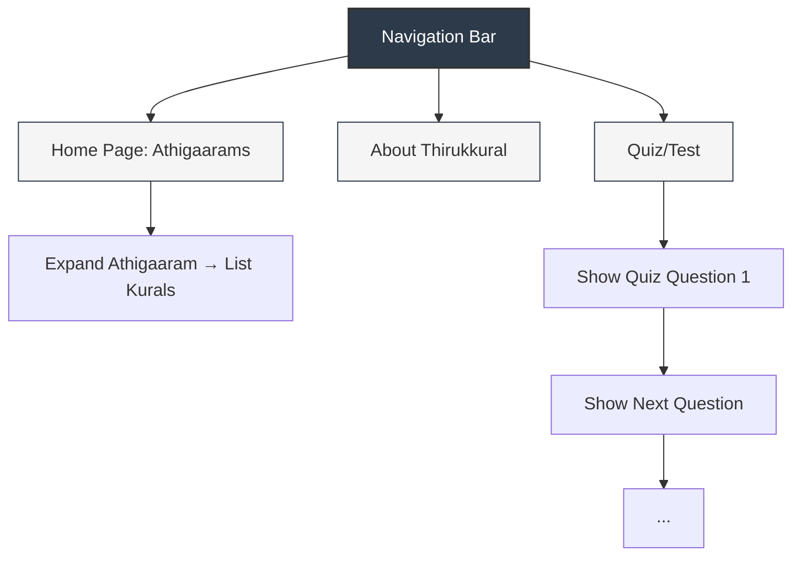

# Thirukkural Explorer React Application – Requirements Specification

## 1. Overview

The Thirukkural Explorer is a responsive, lightweight React web application designed to allow users to explore the ancient Thirukkural text through a modern UI. The application provides accessible navigation for learning, includes chapter-wise kural exploration, explanatory content, and interactive quizzes. It is intended for web browsers on both desktop and mobile, offering a visually clean, theme-consistent experience with an iconic Thiruvalluvar image as a background motif on all pages.

---

## 2. Functional Requirements

### 2.1. Home Page with Athigaarams (Chapters) List

- Displays 5 prominent Athigaaram (chapter) cards on the home page.
- Each Athigaaram card is clickable:
  - On clicking, it expands or navigates to reveal a list of Kurals (verses) for that chapter.
  - For each listed Kural:
    - Display original Tamil text.
    - Show an English translation.
    - Provide a brief English explanation.
- The display should be easily navigable and readable, maintaining theme consistency.

### 2.2. Navigation Bar

- A persistent top navigation bar is present on all pages.
- Contains links to:
  - Home
  - About Thirukkural
  - Quiz/Test
- Navigation bar styling must follow the chosen theme colors.
- Should collapse into a mobile-friendly hamburger menu or similar UI on small screens.

### 2.3. About Thirukkural Page

- Accessible from the Navigation Bar.
- Contains static informational content about:
  - The Thirukkural (its history, structure, significance)
  - Thiruvalluvar (the author)
- Follows the established app visual theme.

### 2.4. Quiz Page

- Interactive page for testing user’s knowledge.
- Features:
  - Multiple-choice questions (MCQ) and/or matching questions (such as matching a Kural to its explanation).
  - Placeholder data/logic may be used initially, with proper structure for eventual dynamic question sourcing.
  - Clear display of each question with multiple answer options.
- Tracks current question and transitions smoothly between them.
- Responsive feedback to user answers (e.g., highlighting correct/incorrect).

### 2.5. Themed Visual and Responsive Design

- All pages should have a visually clean and simple UI, prioritizing readability.
- A transparent/faded Thiruvalluvar image serves as a non-intrusive background on every page.
- All components and layouts must be responsive and mobile-friendly.
- Typography should be modern, easy to read, and unified across pages.

---

## 3. Technical Requirements

### 3.1. Frameworks and Languages

- **Frontend:** React JS (no backend; all data is static or embedded).
- **Languages:** JavaScript (ES6+), CSS (vanilla, no UI frameworks).

### 3.2. Project Structure & Assets

- Application code is under the `thirukkural_explorer_web_app/src` directory.
- Styles are defined in `App.css` and related CSS files, using CSS variables.
- Image assets, including the Thiruvalluvar background, should be placed in the `src/assets/` directory or similar location.

### 3.3. Routing

- Uses `react-router-dom` (to be installed if not present) for client-side page navigation.
- Routes:
  - `/`          → Home Page (Athigaarams)
  - `/about`     → About Thirukkural Page
  - `/quiz`      → Quiz Page
- Navigation must not trigger full page reloads (SPA behavior).

### 3.4. State Management

- Local React state only; no external state management libraries.
- Simple data for Athigaarams, Kurals, and quiz questions can be defined as static JavaScript objects or arrays within the project.

---

## 4. Visual/Theme Specifications

### 4.1. Color Palette

- **Primary:** #2D3A4A (used for backgrounds, header, main surfaces)
- **Secondary:** #F5F5F5 (used for backgrounds, content cards, surfaces)
- **Accent:** #C19A6B (used for highlights, buttons, icons)
- **Text:** #ffffff (on dark backgrounds), fallback or alternate: #333333 (on light)

- These variables should be defined as root CSS variables for consistent usage.

### 4.2. Theme & Layout

- The general appearance is “light theme” emphasizing clarity and contrast.
- Main surfaces use the primary color; cards or surfaces may use the secondary color for differentiation.
- Accent color brings warmth and highlights to CTAs or important UI elements.
- The faded Thiruvalluvar background must not disrupt readability—opacity or blending should be controlled accordingly.
- Button, card, and container corner radii should be subtle (e.g., 4px).

### 4.3. Images and Icons

- A transparent and subtle Thiruvalluvar image appears (centered, bottom, or on the side) on the background of all pages.
- The app icon/logo may incorporate a traditional symbol or minimalist “Kural” motif, paired with modern typography.

---

## 5. Routing & Navigation

- The navigation bar is fixed to the top, is always visible, and never overlaps critical content.
- Each link in the navigation bar must highlight (e.g., bold/underline or color change) when active or hovered.
- On mobile screens, the navigation condenses into a hamburger or drawer format.
- All routes (`/`, `/about`, `/quiz`) must be accessible via direct navigation and deep linking.

---

## 6. Accessibility & Usability

- All interactive elements (buttons, navigation links) are keyboard accessible.
- Adequate color contrast must be maintained for readability.
- The background Thiruvalluvar image must not interfere with text legibility.
- Tap/click targets comply with mobile usability standards (minimum size ~48x48px).

---

## 7. Data & Content Constraints

- Athigaaram, Kural, and Quiz data is static within the React frontend for the current scope; no API/backend is required.
- Placeholder quiz questions may be used at first, but must demonstrate the target structure.

---

## 8. Non-functional Requirements

- **Performance:** Fast page load and navigation; minimal assets.
- **Dependency Management:** Only essential libraries (React, react-router-dom); no heavy UI frameworks.
- **Code Quality:** Linting/ESLint applied; uses modern JS and React patterns.
- **Responsiveness:** Fully mobile-friendly, works on major browsers.

---

## 9. Design Constraints

- Pure CSS (no external UI or component libraries).
- All pages must feel visually related, with a single coherent theme.
- Only the specified colors and theme may be used, unless further branding is introduced.
- Ensure the application is easy to extend, so more chapters, quiz content, or explanatory material can be added with minimal refactoring.

---

## 10. Out of Scope

- User authentication or profiles.
- Backend server or dynamic content fetching.
- Audio, video, or animation features (unless required for visual polish).

---

## 11. Future Enhancements (Not in Current Requirements)

- API-based dynamic loading of Kural content.
- User progress tracking on quizzes.
- Ability to select from all 133 Athigaarams (initial requirement is only 5).
- Multilingual UI support or additional regional translations.

---

## 12. Sample UI Flow Diagram (Mermaid)

---

## 13. References

- [Thirukkural - Wikipedia](https://en.wikipedia.org/wiki/Tirukkural)
- Project README and implementation plan

---

## 14. Glossary

- **Athigaaram:** A chapter of the Thirukkural (grouping 10 Kurals each)
- **Kural:** A two-line poetic verse, basic unit of the Thirukkural
- **SPA:** Single Page Application (navigates without full reload)
- **CTA:** Call to Action (key button or interaction)

---
